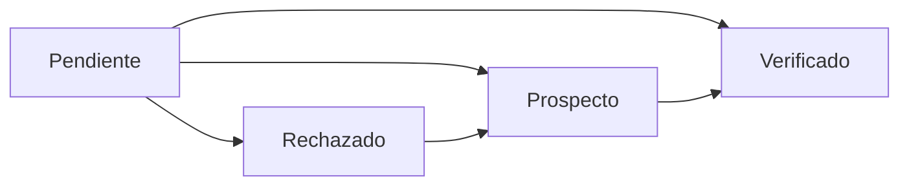

# 📋 Módulo de Validación de Clientes

## Descripción
Módulo integrado en el bot de Telegram para gestionar la validación de clientes registrados a través del bot de WhatsApp. Permite revisar, validar y cambiar el estado de los clientes de manera eficiente.

## 🎯 Funcionalidades

### 1. **Filtrado de Clientes por Estado**
- **Pendientes**: Clientes esperando validación inicial
- **Verificados**: Clientes aprobados y activos
- **Rechazados**: Clientes que no cumplen requisitos
- **Prospectos**: Registros iniciales sin validar
- **Ver todos**: Lista completa sin filtros

### 2. **Visualización de Detalles**
Cada cliente muestra:
- **Datos de contacto**: Empresa, contacto, WhatsApp, teléfono, email
- **Ubicación**: Dirección completa, distrito, ciudad
- **Historial**: Fecha de registro, última compra, total de pedidos
- **Métricas**: Total comprado en soles, total en kilogramos
- **Notas**: Observaciones adicionales
- **Imagen**: URL de la foto de la cafetería (si está disponible)

### 3. **Cambio de Estado**
Permite actualizar el estado del cliente directamente desde Telegram:
- Selección rápida con botones inline
- Actualización inmediata en Google Sheets
- Confirmación visual del cambio

## 📱 Comandos

### Comando Principal
```
/clientes
```
Muestra directamente los clientes pendientes de validación (comportamiento por defecto)

### Comandos Alternativos
```
/validar_clientes
```
Alias del comando principal

## 🔄 Flujo de Trabajo

### 1. Registro de Cliente (WhatsApp Bot)
```
Cliente → WhatsApp Bot → Registro en Google Sheets (Estado: Pendiente)
```

### 2. Validación (Telegram Bot)
```
Admin → /clientes → Filtrar pendientes → Ver detalles → Cambiar estado
```

### 3. Estados Posibles


## 📊 Estructura en Google Sheets

### Hoja: Clientes
| Columna | Campo | Descripción |
|---------|-------|-------------|
| A | ID | Identificador único del cliente |
| B | WhatsApp | Número de WhatsApp |
| C | Empresa | Nombre de la empresa/negocio |
| D | Contacto | Nombre del contacto |
| E | Teléfono | Teléfono adicional |
| F | Email | Correo electrónico |
| G | Dirección | Dirección de entrega |
| H | Distrito | Distrito |
| I | Ciudad | Ciudad (default: Lima) |
| J | Fecha Registro | Fecha de registro inicial |
| K | Última Compra | Fecha de última compra |
| L | Total Pedidos | Cantidad total de pedidos |
| M | Total Comprado | Monto total en soles |
| N | Total Kg | Total en kilogramos |
| O | Notas | Observaciones |
| P | Estado | Estado actual del cliente |
| Q | Imagen URL | URL de la imagen de la cafetería |

## 🛠️ Configuración

### Variables de Entorno Requeridas
```bash
TELEGRAM_BOT_TOKEN=tu_token_de_telegram
GOOGLE_SPREADSHEET_ID=id_de_tu_spreadsheet
GOOGLE_SERVICE_ACCOUNT_KEY=json_de_credenciales
```

### Permisos en Google Sheets
El Service Account debe tener permisos de Editor en la hoja de cálculo.

## 💡 Uso Típico

### Validar Clientes Pendientes (Flujo Principal)
1. Ejecutar `/clientes`
2. **Automáticamente muestra clientes pendientes** 🎯
3. Elegir un cliente de la lista
4. Revisar detalles y foto de la cafetería
5. Cambiar estado a:
   - ✅ Verificado (si cumple requisitos)
   - ❌ Rechazado (si no cumple)
   - 🔍 Prospecto (si necesita más información)

**Nota**: Si no hay clientes pendientes, se mostrará automáticamente el menú de filtros para ver otros estados.

### Revisar Clientes Verificados
1. Ejecutar `/clientes`
2. Seleccionar "✅ Clientes verificados"
3. Ver lista de clientes activos
4. Revisar detalles según necesidad

## 🔍 Características Especiales

### Visualización de Imagen
- Si el cliente tiene una imagen de su cafetería, se mostrará junto con los detalles
- La imagen ayuda a validar la legitimidad del negocio
- Enlaces directos a las imágenes almacenadas en Google Drive

### Cache de Datos
- Los datos se cachean por 30 segundos para mejorar rendimiento
- Actualización forzada disponible al cambiar estados

### Límites de Visualización
- Máximo 15 clientes por página (limitación de Telegram)
- Clientes más recientes se muestran primero

## 🐛 Troubleshooting

### El comando no responde
```bash
# Verificar logs
heroku logs --tail --app cafe-bot-telegram

# Reiniciar bot
heroku restart --app cafe-bot-telegram
```

### No se ven los clientes
1. Verificar que el SPREADSHEET_ID sea correcto
2. Confirmar que la hoja "Clientes" existe
3. Verificar permisos del Service Account

### Error al cambiar estado
1. Verificar conexión con Google Sheets
2. Confirmar que la columna P existe para estados
3. Revisar logs para errores específicos

## 📈 Métricas

El módulo permite analizar:
- Tasa de conversión (Pendiente → Verificado)
- Tiempo promedio de validación
- Clientes rechazados vs aceptados
- Distribución geográfica por distrito

## 🔒 Seguridad

- Solo usuarios autorizados del bot Telegram pueden validar
- Cambios de estado se registran en logs
- No se exponen datos sensibles en los mensajes

## 🚀 Deployment

### Deploy Inicial
```bash
cd cafe-bot-telegram
chmod +x deploy-clientes-validacion.sh
./deploy-clientes-validacion.sh
```

### Actualización
```bash
git add -A
git commit -m "update: Mejoras en validación de clientes"
git push heroku main
```

## 📝 Notas de Desarrollo

### Futuras Mejoras
- [ ] Paginación para más de 15 clientes
- [ ] Búsqueda por nombre o empresa
- [ ] Exportación de reportes
- [ ] Notificaciones automáticas de nuevos clientes
- [ ] Historial de cambios de estado
- [ ] Integración con WhatsApp para notificar validación

### Dependencias
- `python-telegram-bot`: Para interfaz de Telegram
- `google-api-python-client`: Para Google Sheets
- `pytz`: Para manejo de zonas horarias

## 📞 Soporte

Para problemas o consultas sobre este módulo:
1. Revisar esta documentación
2. Consultar logs en Heroku
3. Abrir un issue en el repositorio
4. Contactar al equipo de desarrollo

---

**Última actualización**: Octubre 2024
**Versión**: 1.0.0
**Autor**: Sistema de Gestión Café Bots
